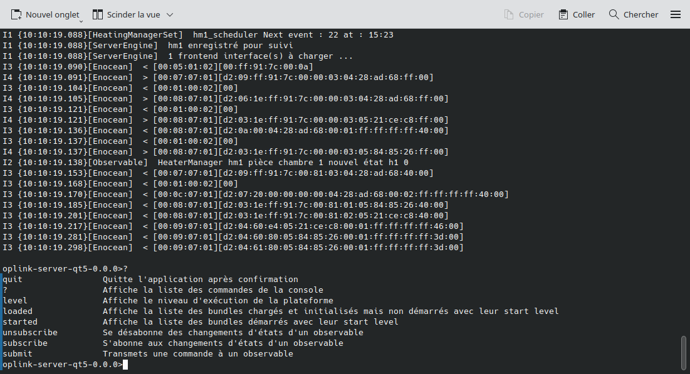
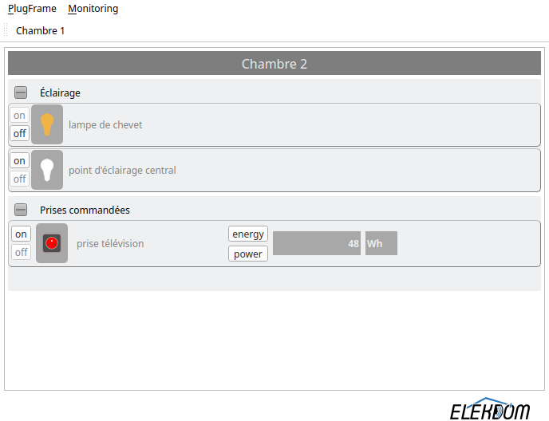

# OpLink

**OpLink** is a modular supervision and control platform built in C++/Qt, designed to connect, 
observe and control heterogeneous systems through a unified and extensible software architecture.

Built on top of the [PlugFrame](https://github.com/elekdom/PlugFrame) framework, 
PlugFrame is used as a runtime framework and service container. OpLink provides application-specific bundles, launchers and profiles on top of it.

OpLink provides the foundations for:
- **Supervision and monitoring** of distributed systems,
- **Control and command** of equipment and services,
- **Interoperability between heterogeneous technologies** (protocols, devices, domains),
- **Scalable client/server architectures**, from embedded systems to desktop applications.

OpLink is designed as a technical demonstrator and a reusable base for industrial, 
building automation, and energy-related software systems.

---

## Core Concepts

OpLink is built around a **service-oriented and observable-based architecture**.

At its core, OpLink relies on the concept of **Observables**:
- An *Observable* represents any measurable or controllable element of a system
  (sensor value, equipment state, command, etc.).
- Observables provide a **common abstraction layer** between technologies,
  allowing heterogeneous systems to interoperate without tight coupling.

This approach enables:
- Technology-agnostic supervision,
- Decoupling between data producers and consumers,
- Runtime extensibility through dynamically loaded modules (bundles).

OpLink uses PlugFrame’s dynamic plugin system to assemble applications at runtime,
where each bundle provides or consumes services related to supervision, control,
communication or user interaction.

## Architecture Overview

The application is divided into two main execution domains, reflecting a typical
**supervision architecture**:

- **Backend Server** (built when `OL_BUILD_BACKEND=ON`):
  - Provides supervision, control and interoperability services (device communication, logging, user authentication, remote monitoring).
  - Headless by default (no GUI).
  - Bundles include `enoceaninfrastructure`, `observablemodelloader`, `users`, `logger`, etc.

- **Frontend GUI Client** (built when `OL_BUILD_FRONTEND=ON`):
  - Built using Qt's GUI module (QWidgets).
  - Provides user interface to monitor and interact with backend services.
  - Connects to the backend over TCP using a dedicated client-side bundle.

Both sides leverage PlugFrame’s dynamic service registration and communication APIs.

---

## Repository Structure

```bash
OpLink/
├── oplink/
│   ├──backend-bundles/                # OpLink server bundles
│   ├──backend-launcher                # OpLink server launcher
│   ├──core-backend-lib                # OpLink server dynamic library
│   ├──core-lib                        # OpLink dynamic library for both server and client
│   ├──frontend-bundles                # OpLink client bundles
│   ├──frontend-launcher               # OpLink client launcher
├── cmake/oplink_runtime_install.cmake # Script for binaries and conf files post-build install
├── .img/                              # Screenshots and graphical assets
└── CMakeLists.txt                     #  Main CMake configuration file
```
---

## Requirements

- **Qt 6.x (tested with 6.9.3)**
- **CMake ≥ 3.19**
- C++17 compatible compiler (tested with `g++` on **Kubuntu 25.10**)
- Recommended: [QtCreator](https://www.qt.io/product/development-tools) for development
---

## Cloning Instructions

OpLink needs PlugFrame. You must **clone PlugFrame first**.

```bash
# Clone the PlugFrame
git clone https://github.com/elekdom/PlugFrame.git
cd PlugFrame
git checkout qt6_cmake

# Clone OpLink inside 
git clone https://github.com/elekdom/OpLink.git
cd OpLink
git checkout qt6_cmake

```

Your resulting structure should look like:

```bash
PlugFrame/
├──  plugframe
├──  ...
OpLink/
├──  oplink/
├───────core-lib/            # core lib for backend and frontend
├───────core-backend-lib/    # core lib for backend
├───────backend-bundles/     # OpLink backend (server) bundles
├───────backend-launcher/    # OpLink backend launcher
├───────frontend-bundles/    # OpLink frontend (GUI client) bundles
├───────frontend-launcher/   # OpLink frontend launcher

```
---

## Build Instructions

The recommended approach is to use **Qt Creator**

Alternatively, from the root of OpLink, you may use:

```bash
cmake -S . -B build
cmake --build build
```
### Build Options

OpLink provides configurable build options to enable or disable its main components.

#### Available CMake options

| Option | Default | Description |
|------|---------|-------------|
| `OL_BUILD_BACKEND`  | ON | Build the OpLink backend (server-side components) |
| `OL_BUILD_FRONTEND` | ON | Build the OpLink frontend (GUI client application) |

These options control which parts of OpLink are built.

They also implicitly configure PlugFrame as follows:
- Backend build requires PlugFrame **TEXT** components
- Frontend build requires PlugFrame **GUI** components

### Runtime installation

OpLink installs a complete runtime layout into a binary directory.

By default, the runtime is installed under:

```bash
<install-prefix>
```

You can override the destination using:

```bash
cmake -S . -B build -DOL_RUNTIME_ROOT=/path/to/runtime
cmake --build build
```
### Build examples

#### Full build (backend + frontend)
```bash
cmake -S . -B build \
  -DOL_BUILD_BACKEND=ON \
  -DOL_BUILD_FRONTEND=ON
```
#### Backend-only build (headless / server)
```bash
cmake -S . -B build \
  -DOL_BUILD_BACKEND=ON \
  -DOL_BUILD_FRONTEND=OFF
```
This configuration is suitable for server deployments or embedded targets such as Raspberry Pi.

#### Frontend-only build (GUI client)
```bash
cmake -S . -B build \
  -DOL_BUILD_BACKEND=OFF \
  -DOL_BUILD_FRONTEND=ON
```


---

## Post-build runtime generation  
*(CMake target: `oplink_runtime_install`)*

The following variables **must be defined at configuration time**:

- `OL_PROFILES_ROOT_DIR`
- `OL_SELECTED_PROFILE_NAME`

```bash
cmake -S . -B build   
    -DOL_PROFILES_ROOT_DIR="/path/to/profiles"   
    -DOL_SELECTED_PROFILE_NAME="profileDir"

cmake --build build --target oplink_runtime_install
```

This step generates a complete binary runtime tree based on the selected profile.

---

### Generated Binary Structure

```bash
<OL_RUNTIME_ROOT>/bin/
                  ├── libs/            # Shared dynamic libraries from PlugFrame & OpLink
                  ├── oplink_backend/  # Server-side executable (non-GUI)
                  └── oplink_frontend/ # Client-side GUI application
```

- The `libs/` directory contains all shared libraries from both PlugFrame and OpLink.
- The `oplink_backend/` directory includes the **server executable**, typically running without a GUI.
- The `oplink_frontend/` directory contains the **graphical client application** for user interaction.

---

## Preview

 The OpLink server's Console Overview

 The OpLink client's Console Overview

---

## License

OpLink is released under the GNU General Public License v3.0 (GPLv3).

(c) ELEKDOM 2023–2025

## Roadmap

> Work in progress — this repository currently serves as a **technical demonstrator**.

### Next milestones:

- Raspberry Pi cross compilation
- Windows, macOS, Android and iOS compilation
- Unit tests and CI integration
- GitHub wiki with technical documentation
- First packaged release (v0.1.0)
- Integration of Knx, Lora and many others
- Development of a scenario engine
- Development of a tool for OpLink configuration
- ***and more according to future needs expressed***

---

## Contributions & Services

OpLink is actively maintained by **ELEKDOM**.  
If you're interested in:

- Using OpLink in your project
- Custom adaptations or training
- Commercial partnerships or technical contributions

**Contact us via LinkedIn or https://elekdom.fr or contact@elekdom.fr**.

